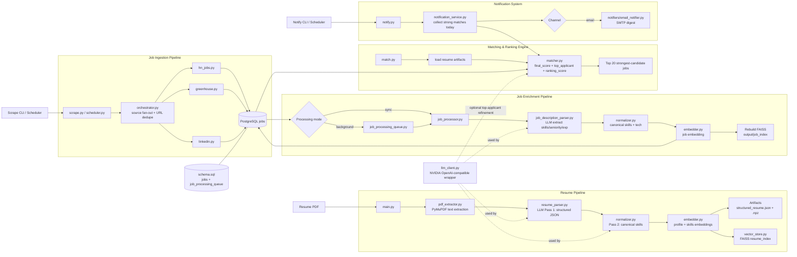

# JobFinder Architecture

## One-page system diagram

## Runtime flow (concise)

1. **Resume side**: PDF → structured resume JSON → normalized skills → resume embeddings + FAISS resume index.
2. **Jobs side**: scrapers ingest raw jobs into PostgreSQL (dedup by URL).
3. **Enrichment side**: raw job descriptions are parsed, normalized, embedded, and stored back; FAISS job index is rebuilt.
4. **Ranking side**: matcher computes `final_score`, predicts `top_applicant_score`, then ranks with multi-factor `ranking_score` (final score + salary + company reputation + location preference).
5. **Notification side**: daily digest filters today's matches by thresholds (top-applicant + ranking score) and sends top 10 via email.

## Scoring stack

- **Match score (`final_score`)**
  - semantic similarity
  - skill overlap
  - experience match
- **Top applicant prediction (`0-100`)**
  - experience alignment (`required <= resume + 1` boost)
  - skill coverage boost (`>=80%` boost)
  - seniority/location compatibility
  - company hiring aggressiveness signal
  - optional LLM refinement
- **Ranking score (`0-1`)**
  - weighted blend of `final_score`, salary score, company reputation score, and location preference score

## Key boundaries

- **LLM boundary**: all model calls are centralized in `src/llm_client.py`.
- **Persistence boundary**: DB operations live in `src/db/db.py`.
- **Retrieval boundary**: vector indexing/search is isolated in `src/vector_store.py`.
- **Orchestration boundary**: source fan-out and execution policy are in `src/scrapers/orchestrator.py`.
- **Notification boundary**: digest assembly and delivery live in `src/notification_service.py` + `src/notifiers/`.
