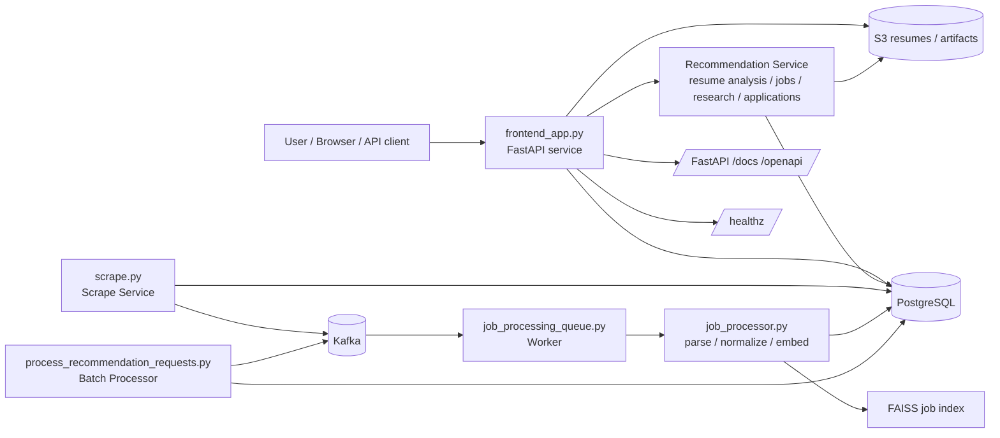

# JobFinder Architecture

## One-page system diagram

```mermaid
flowchart LR
  U[User / Browser / API client] --> FE[frontend_app.py\nFastAPI service]
  FE --> PG[(PostgreSQL)]
  FE --> S3[(S3 resumes / artifacts)]
  FE --> RS[Recommendation Service\nresume analysis / jobs / research / applications]

  RS --> PG
  RS --> S3

  SCR[scrape.py\nScrape Service] --> PG
  SCR --> K[(Kafka)]
  K --> W[job_processing_queue.py\nWorker]
  W --> JP[job_processor.py\nparse / normalize / embed]
  JP --> PG
  JP --> IDX[FAISS job index]

  BATCH[process_recommendation_requests.py\nBatch Processor] --> PG
  BATCH --> K

  FE --> DOCS[/FastAPI /docs /openapi/]
  FE --> HEALTH[/healthz/]
```

## Runtime flow

1. FastAPI receives user uploads and service requests.
2. Recommendation services call the matching, research, application, and coaching layers directly.
3. Scrape jobs are written to PostgreSQL and wake Kafka-backed workers.
4. Workers parse, normalize, embed, and index job data.
5. Batch processors handle nightly candidate recommendation runs.

## Key boundaries

- **API boundary**: FastAPI in [frontend_app.py](frontend_app.py).
- **Service boundary**: direct business functions in [src/services/jobfinder_services.py](src/services/jobfinder_services.py).
- **Persistence boundary**: PostgreSQL in [src/db/db.py](src/db/db.py).
- **Dispatch boundary**: Kafka in [src/messaging/kafka_bus.py](src/messaging/kafka_bus.py).
- **Index boundary**: FAISS under `output/`.
