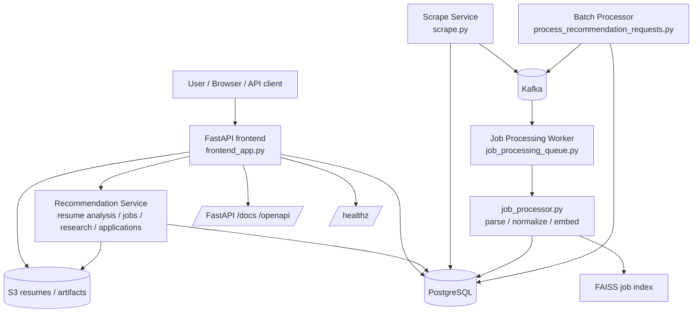

# HLD: JobFinder.io Microservices Architecture

## 1. Purpose

JobFinder.io now uses a microservices-oriented design built around FastAPI, Kafka, PostgreSQL, S3, and file-based FAISS indexes. The goal is to keep the core pipeline deterministic while making long-running work asynchronous and independently deployable.

## 2. Architecture Diagram

## 3. Service Boundaries

### FastAPI Frontend

- Serves the browser UI.
- Exposes JSON endpoints for resume analysis, job discovery, company research, application tracking, ATS optimization, interview prep, career coaching, and recommendation planning.
- Handles resume uploads and queues request records in PostgreSQL.

### Recommendation Service

- Orchestrates direct service calls for resume analysis, job discovery, company research, application tracking, and coaching.
- Replaces the former agent runtime with plain service functions.
- Keeps the request/response boundary explicit and API-friendly.

### Scrape Service

- Collects jobs from sources such as LinkedIn, Greenhouse, and HN Jobs.
- Upserts raw jobs into PostgreSQL.
- Publishes Kafka wake-up events for background processing.

### Job Processing Worker

- Consumes queued processing work.
- Runs parsing, normalization, embedding, and FAISS index rebuilds.
- Uses PostgreSQL for queue state and retries.

### Batch Processor

- Processes queued recommendation requests.
- Downloads resumes from S3.
- Runs the resume pipeline, scraping, matching, and notification steps.

## 4. Data Flow

1. The user uploads a resume or submits a JSON workflow request through FastAPI.
2. PostgreSQL stores request state, application records, and job metadata.
3. Kafka carries background work notifications and retry wake-ups.
4. The processing worker enriches jobs and rebuilds the FAISS index.
5. The recommendation service and batch processor run matching, research, tracking, and notification logic.

## 5. Storage Model

- PostgreSQL is the source of truth for jobs, request state, applications, and processing metadata.
- S3 stores uploaded resumes and large generated artifacts.
- FAISS indices remain file-backed artifacts under `output/`.
- Kafka is a transport layer, not a source of truth.

## 6. Operational Model

- Deploy FastAPI as the public-facing API service.
- Deploy the job processing worker separately when Kafka dispatch is enabled.
- Deploy the batch recommendation processor as a scheduled job.
- Keep services stateless where possible and let PostgreSQL own durable state.

## 7. Reliability and Security

- Use idempotent database writes for request and job state transitions.
- Keep retries and dead-letter behavior in Kafka consumers and batch runners.
- Store credentials only in environment variables or secret managers.
- Avoid putting user resume content or LLM prompts in logs.
