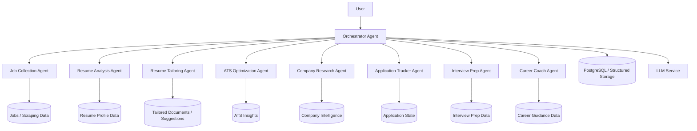

# HLD: AI Agent Layer for JobFinder.io

## 1. Purpose

This document proposes a new AI agent layer for JobFinder.io that extends the existing job discovery and matching workflow with specialized agents for sourcing, resume optimization, company research, application tracking, interview preparation, and career coaching.

The goal is to move from a mostly batch pipeline to a more proactive, assistant-like experience where the system can reason about a candidate’s profile, target roles, and application progress.

## 2. Objectives

- Add an orchestrated multi-agent workflow on top of the current pipeline.
- Improve job-to-candidate relevance using personalized agent reasoning.
- Provide actionable coaching and application support for each target role.
- Keep the architecture modular so new agents can be added easily.
- Reuse existing project components where possible instead of rebuilding them.

## 3. Non-Goals

- Fully autonomous job applications without human review.
- Replacing the current scraping, parsing, matching, and notification flows.
- Building a large-scale enterprise agent platform in the first iteration.

## 4. Current System Context

JobFinder.io already has a strong foundation:

- Resume intake from the Streamlit frontend.
- Resume parsing and normalization.
- Job scraping and ingestion.
- Job enrichment and embedding.
- Matching and ranking.
- Email notifications.

The new agent layer will sit above this system and coordinate specialized tasks using the existing data and services.

## 5. Proposed Architecture

### 5.1 High-Level Flow



### 5.2 Agent Responsibilities

#### Orchestrator Agent

- Receives user intent and goals.
- Chooses which specialist agents to invoke.
- Maintains workflow state and execution order.
- Aggregates outputs into a unified plan.

#### Job Collection Agent

- Identifies promising roles based on the user profile and target roles.
- Filters jobs for relevance, urgency, and fit.
- Can trigger the existing scraping and matching pipeline.

#### Resume Analysis Agent

- Extracts strengths, gaps, and positioning themes from the user resume.
- Produces a candidate profile with skills, experience narrative, and missing capabilities.
- Reuses the existing resume parsing and normalization modules.

#### Resume Tailoring Agent

- Creates tailored resume versions for specific job descriptions.
- Suggests reordering sections, rewriting bullets, or highlighting relevant skills.
- Produces recommendations that can be reviewed before use.

#### ATS Optimization Agent

- Evaluates the resume against a job description for ATS compatibility.
- Recommends keywords, section alignment, and formatting improvements.
- Helps improve match scores before applying.

#### Company Research Agent

- Builds company-specific insights: mission, product, hiring signals, likely interview themes, and role context.
- Combines public web information with internal job and resume context.

#### Application Tracker Agent

- Tracks applied jobs, follow-up dates, statuses, and next actions.
- Can remind the user of deadlines and recommended follow-ups.
- Maintains a structured application history.

#### Interview Prep Agent

- Generates interview preparation material from the role, company, and resume.
- Produces likely questions, talking points, STAR stories, and briefing notes.

#### Career Coach Agent

- Provides ongoing career guidance.
- Suggests skill gaps, role transitions, and long-term positioning strategy.
- Helps the user make better choices beyond a single application cycle.

## 6. System Components

### 6.1 Core Runtime Layer

A lightweight agent runtime will be introduced to manage execution.

Suggested responsibilities:

- Define agent contracts.
- Maintain workflow state.
- Execute agent steps in sequence or parallel.
- Retry failed steps with backoff.
- Emit logs and metrics.

### 6.2 Storage Layer

The agent layer should persist structured outputs in the existing database and file-based artifacts.

Recommended stores:

- PostgreSQL for workflow state, applications, and agent outputs.
- JSON or structured files for generated artifacts such as tailored resumes and interview briefs.
- Object storage for larger outputs such as documents and generated summaries.

### 6.3 LLM Integration Layer

The current LLM wrapper should remain the single entry point for language model calls.

This ensures:

- Consistent model configuration.
- Centralized prompt management.
- Easier cost control and observability.

## 7. Integration with Existing JobFinder Modules

The agent system should reuse the current project structure rather than duplicate logic.

### Reuse Targets

- [src/llm_client.py](src/llm_client.py) for LLM access.
- [src/db/db.py](src/db/db.py) for persistence.
- [src/resume_parser.py](src/resume_parser.py) and [src/normalizer.py](src/normalizer.py) for resume understanding.
- [src/scrapers/orchestrator.py](src/scrapers/orchestrator.py) and [src/scrapers](src/scrapers) for job collection.
- [src/matcher.py](src/matcher.py) for ranking and relevance logic.
- [src/notification_service.py](src/notification_service.py) for user follow-up messaging.

### Proposed New Modules

- agent_orchestrator.py
- agents/base_agent.py
- agents/job_collection_agent.py
- agents/resume_analysis_agent.py
- agents/resume_tailoring_agent.py
- agents/ats_optimization_agent.py
- agents/company_research_agent.py
- agents/application_tracker_agent.py
- agents/interview_prep_agent.py
- agents/career_coach_agent.py
- agent_state.py
- agent_events.py

## 8. Data Model Concepts

### 8.1 User Profile

Represents the candidate’s background, goals, target roles, and preferences.

### 8.2 Agent Run

Represents one execution of an agent or a workflow step.

Fields may include:

- user_id
- agent_name
- status
- started_at
- completed_at
- input_hash
- output_summary
- error_message

### 8.3 Agent Artifact

Stores structured outputs such as:

- tailored resume suggestions
- ATS scoring results
- interview prep notes
- company research summary
- career guidance plan

### 8.4 Application Record

Tracks each application lifecycle:

- job_id
- applied_at
- status
- follow_up_due_at
- notes
- last_agent_update

## 9. Execution Model

### 9.1 Workflow Pattern

The orchestrator should support:

- sequential workflows for high-value tasks such as tailoring and ATS review.
- parallel workflows for independent tasks such as company research and interview prep.
- event-driven triggering after job discovery, resume updates, or application submission.

### 9.2 Example Flow

1. User uploads resume and selects target roles.
2. Orchestrator triggers Resume Analysis and Job Collection agents.
3. The Job Collection agent identifies relevant opportunities.
4. The Resume Tailoring and ATS Optimization agents prepare role-specific recommendations.
5. The Company Research and Interview Prep agents build context for shortlisted roles.
6. The Application Tracker records actions and next steps.

## 10. API and Interface Design

The agent layer should expose simple, structured interfaces.

### Suggested Agent Interface

```python
class BaseAgent:
    def run(self, context: dict) -> dict:
        ...
```

### Suggested Response Shape

```json
{
  "agent": "resume_tailoring",
  "status": "completed",
  "summary": "Tailored resume suggestions generated for 3 roles",
  "artifacts": ["resume_variant_1", "resume_variant_2"],
  "next_actions": ["review suggestions", "apply to selected jobs"]
}
```

## 11. Security and Privacy

- Keep user resumes and personal data in secure storage.
- Avoid storing unnecessary sensitive information in logs.
- Use environment-based secrets for all LLM and notification providers.
- Consider explicit consent before generating coaching or application assistance for sensitive roles.

## 12. Observability and Reliability

The system should provide:

- structured logs per agent run
- task status and retries
- cost tracking for LLM calls
- failure alerts for workflow breakdowns
- human review checkpoints for high-impact outputs

## 13. Implementation Plan

### Phase 1: Foundation

- Introduce the agent runtime and state model.
- Create the orchestrator and base agent interfaces.
- Wire the first two agents: Resume Analysis and Job Collection.

### Phase 2: Core Assistant Features

- Add Resume Tailoring and ATS Optimization.
- Connect outputs to the existing matching pipeline.

### Phase 3: Workflow Expansion

- Add Company Research, Application Tracker, and Interview Prep.
- Add richer summaries and actionable guidance.

### Phase 4: Experience Layer

- Expose agent outputs through the frontend or a dashboard.
- Add notifications, recommendations, and coaching summaries.

## 14. Risks and Mitigations

- Risk: LLM output variability
  - Mitigation: use deterministic prompts, structured outputs, and human review.

- Risk: Token and API cost growth
  - Mitigation: limit verbose agent runs and cache common results.

- Risk: Over-automation
  - Mitigation: keep the user in control and require approval for high-impact actions.

- Risk: Integration complexity
  - Mitigation: implement agents incrementally and reuse existing modules.

## 15. Recommendation

The best first version is a modular agent layer where the Orchestrator Agent coordinates a small set of high-value agents around the existing job matching engine. This keeps the system practical, incremental, and aligned with the current architecture while opening the path to a more intelligent job application assistant over time.
